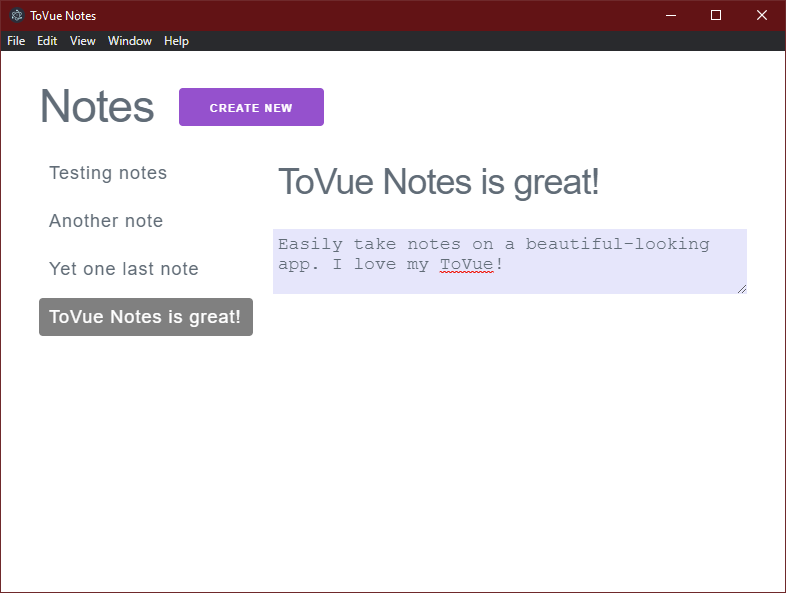

# ToVue Notes

A basic note-taking app made with Vue.js and Electron. Stores notes locally in the browser. 

## How to Build

- add the node_modules folder from Electron;
- npm install
- npm start

## License

ToVue Notes is free software; see [LICENSE](https://github.com/DexterLagan/tovue-notes/blob/main/LICENSE.md) for more details.
